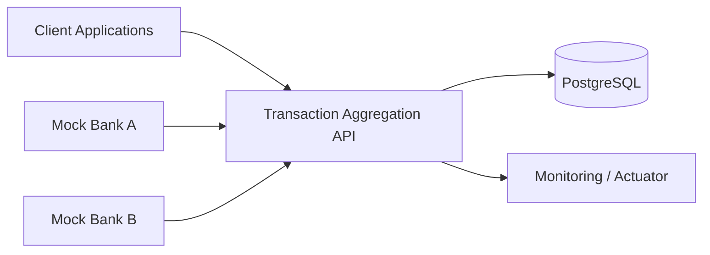
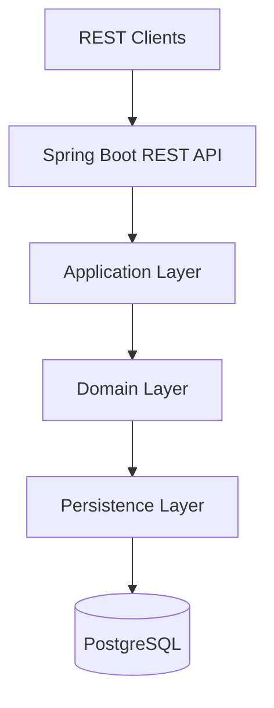
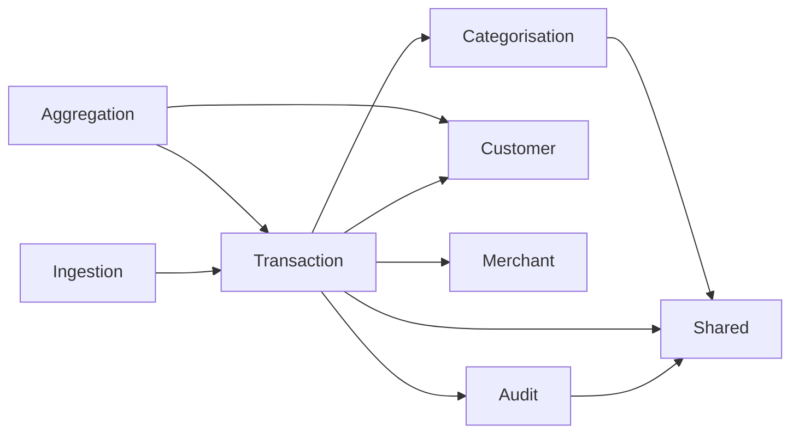
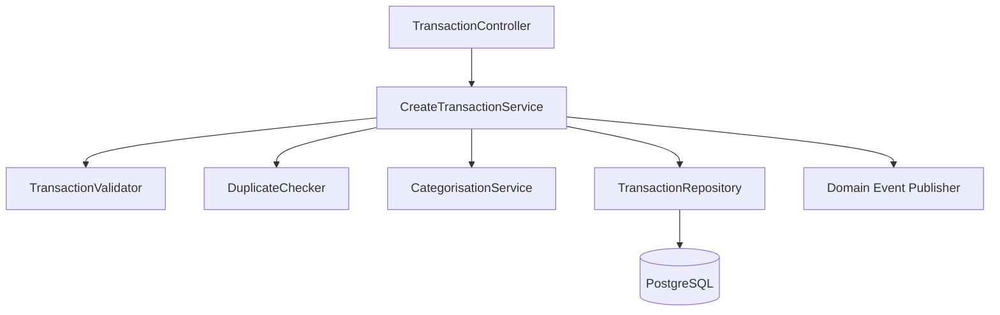
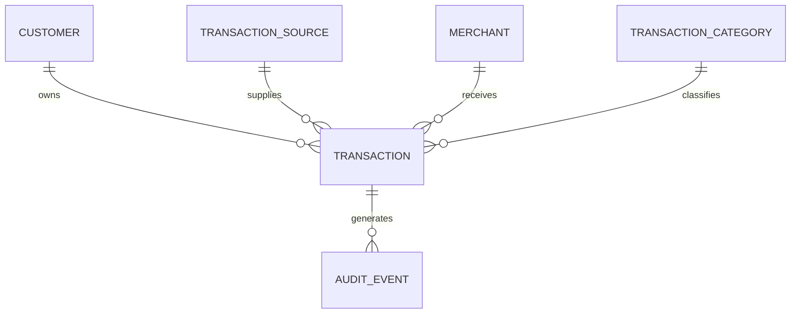
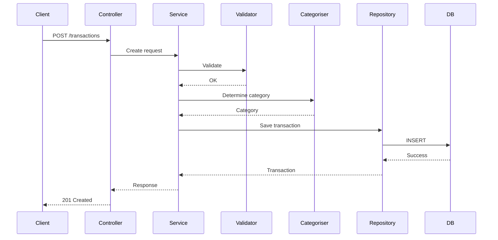
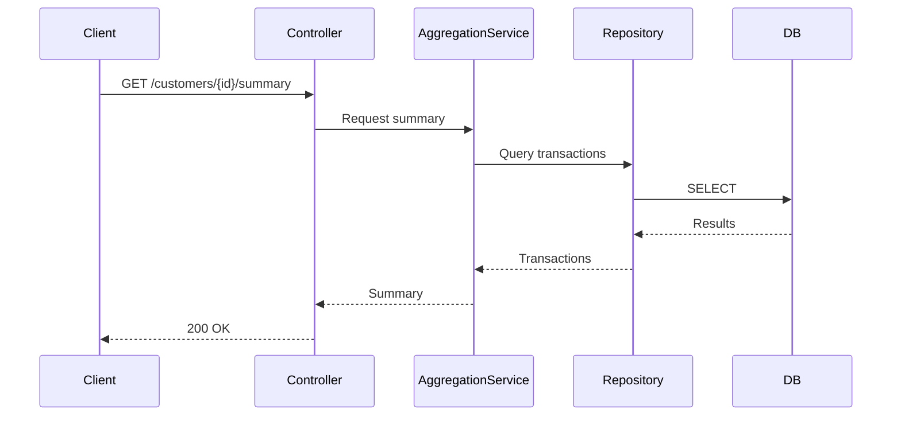
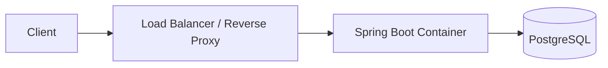
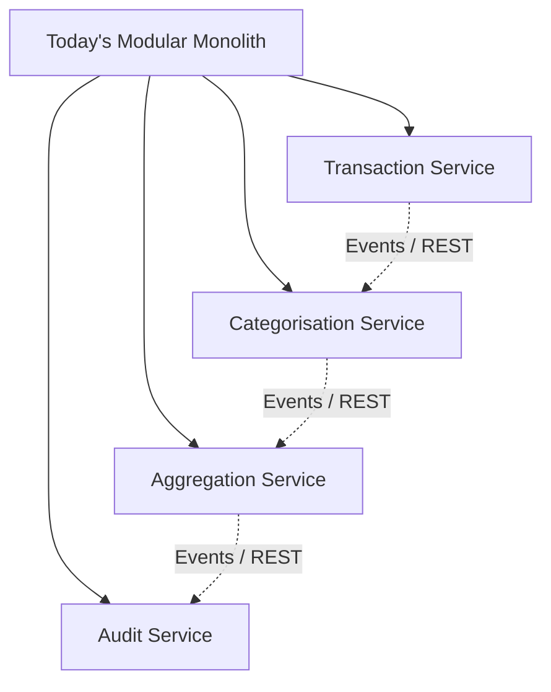

# Transaction Aggregation API
# Solution Architecture Document (SAD)

**Version:** 2.0  
**Author:** Tinyiko Chauke  
**Date:** July 2026  

> This version replaces the previous text-based diagrams with professional Mermaid diagrams that can be rendered by GitHub, GitLab, VS Code, Obsidian and many Markdown viewers.

---

# Table of Contents

1. Introduction
2. Business Context
3. Requirements
4. High-Level Architecture
5. Module Design
6. Domain Model
7. Database Design
8. API Design
9. Security
10. Deployment
11. Testing
12. Scalability
13. Future Evolution
14. ADR Summary
15. Risks
16. Future Improvements

---

# Architecture Diagrams

## 1. C4 Context Diagram

---

## 2. C4 Container Diagram

---

## 3. Module Dependency Diagram

---

## 4. Component Diagram

---

## 5. Crow's Foot Style ER Overview

---

## 6. Sequence Diagram – Create Transaction

---

## 7. Sequence Diagram – Customer Summary

---

## 8. Deployment Diagram

---

## 9. Future Evolution Diagram

---

# Improvements over Version 1

- Replaced all ASCII/text diagrams with Mermaid diagrams.
- Standardised diagram style across the document.
- Added a formal table of contents.
- Ready for rendering on GitHub, GitLab and modern Markdown editors.
- Diagrams align with the approved modular monolith architecture.
- Prepared for future conversion into a PDF or Word document with embedded rendered diagrams.

---

# Remaining SAD Content

The functional requirements, non-functional requirements, business context, architecture decisions, domain model, database design, API design, security, deployment, testing, scalability, ADRs, risks and future improvements from Version 1 remain unchanged and should be appended after these updated sections (or retained from the merged SAD) as they are still valid.
