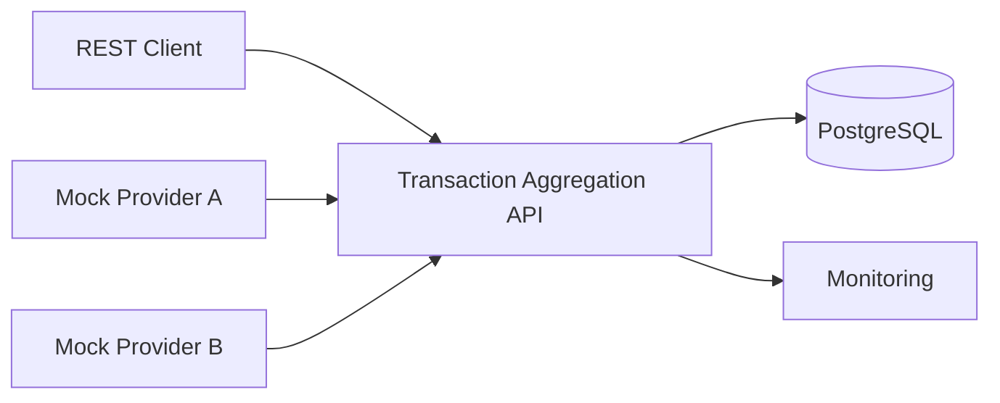
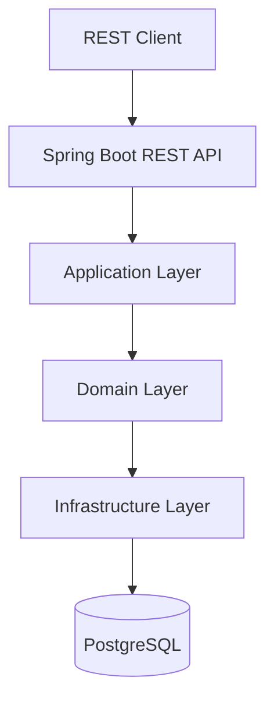
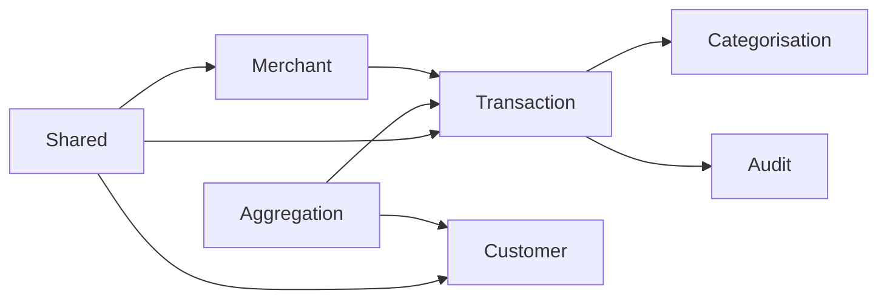
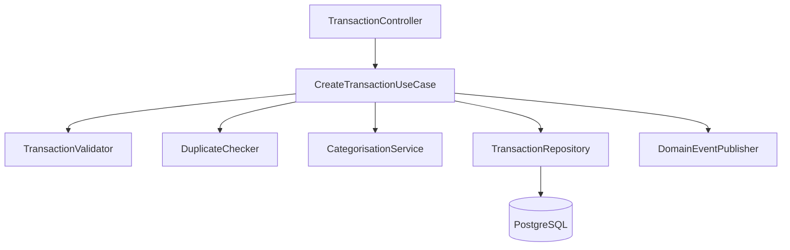

# Transaction Aggregation API
# Solution Architecture Document (SAD)

**Version:** 3.0  
**Part 3 – Architecture**

---

# 18. Architecture Overview

## 18.1 Architectural Style

The Transaction Aggregation API adopts a **Modular Monolith** architecture based on the principles of **Domain-Driven Design (DDD)** and **Clean Architecture**.

The solution is intentionally implemented as a single deployable application while maintaining strict logical separation between business capabilities. Each module owns its domain model, business logic and persistence interfaces, enabling independent evolution without introducing the operational complexity of distributed microservices.

This approach provides:

- High cohesion within modules.
- Low coupling between modules.
- Strong transactional consistency.
- Simplified deployment.
- Easier debugging and testing.
- A clear migration path to microservices.

---

## 18.2 Architectural Principles

The architecture is governed by the following principles:

- Domain-Driven Design
- Clean Architecture
- SOLID Principles
- API First
- Separation of Concerns
- Dependency Inversion
- Single Responsibility
- Security by Design
- Observability by Default
- Evolutionary Architecture

---

## 18.3 Layered Architecture

```text
Presentation Layer
        │
Application Layer
        │
Domain Layer
        │
Infrastructure Layer
```

Responsibilities:

| Layer | Responsibility |
|--------|----------------|
| Presentation | REST controllers, validation, API contracts |
| Application | Use cases and orchestration |
| Domain | Business rules and domain model |
| Infrastructure | Database, security, persistence, external integrations |

---

# 19. C4 Context Diagram



Purpose

The Context Diagram identifies all external actors and systems interacting with the Transaction Aggregation API.

---

# 20. C4 Container Diagram



Purpose

The Container Diagram shows the primary deployable components that make up the solution.

---

# 21. Module Dependency Diagram



Dependency Rules

- Shared module contains reusable abstractions only.
- Domain modules cannot depend on controllers.
- Infrastructure never contains business rules.
- Circular dependencies are prohibited.
- Modules communicate through application services and interfaces.

---

# 22. Component Diagram



Component Responsibilities

| Component | Responsibility |
|-----------|----------------|
| Controller | Accepts REST requests |
| Use Case | Orchestrates business flow |
| Validator | Performs validation |
| Duplicate Checker | Prevents duplicate transactions |
| Categorisation Service | Determines transaction category |
| Repository | Persists aggregates |
| Domain Event Publisher | Publishes business events |

---

# 23. Module Responsibilities

## Shared Module

Responsibilities

- Common abstractions
- Exceptions
- Utilities
- Constants
- Shared DTOs

---

## Transaction Module

Responsibilities

- Transaction aggregate
- Validation
- Duplicate detection
- Persistence
- Search

---

## Customer Module

Responsibilities

- Customer aggregate
- Customer lookup
- Customer summaries

---

## Merchant Module

Responsibilities

- Merchant management
- Merchant normalisation

---

## Categorisation Module

Responsibilities

- Category rules
- Rule engine
- Category assignment

---

## Aggregation Module

Responsibilities

- Financial summaries
- Monthly summaries
- Category summaries
- Merchant summaries

---

## Audit Module

Responsibilities

- Audit events
- Business activity logging
- Traceability

---

# 24. Architectural Decisions

| ADR | Decision | Rationale |
|------|----------|-----------|
| ADR-001 | Modular Monolith | Simpler deployment while preserving modularity. |
| ADR-002 | Domain-Driven Design | Align software with business capabilities. |
| ADR-003 | Clean Architecture | Isolate business logic from frameworks. |
| ADR-004 | PostgreSQL | Mature relational database with ACID guarantees. |
| ADR-005 | Spring Boot | Production-ready Java ecosystem. |
| ADR-006 | Spring Data JPA | Reduce persistence boilerplate. |
| ADR-007 | JWT Authentication | Stateless API security. |
| ADR-008 | Docker | Consistent runtime across environments. |
| ADR-009 | OpenAPI | Self-documenting REST APIs. |
| ADR-010 | Domain Events | Decouple modules and support future microservices. |

---

# 25. Architecture Summary

The Transaction Aggregation API is intentionally designed as a modular monolith that combines the operational simplicity of a single deployable application with the maintainability of independently evolving business modules.

Strict adherence to Domain-Driven Design and Clean Architecture ensures that business logic remains isolated from infrastructure concerns, enabling easier testing, maintenance and future migration to distributed services if required.

---

## End of Part 3

The next section introduces the complete domain model, entities, value objects, database design and ER diagrams.
