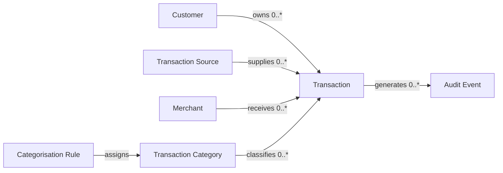
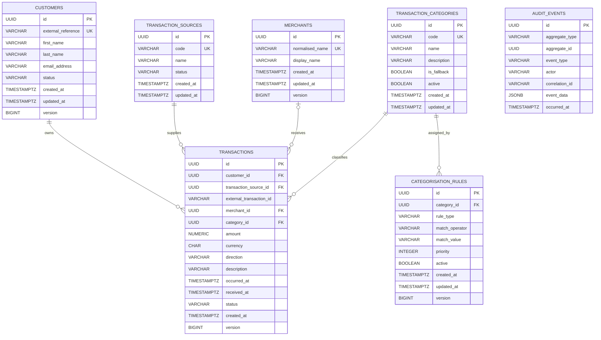

# Transaction Aggregation API
# Solution Architecture Document (SAD)

**Version:** 3.0  
**Part 4 – Domain & Data**

---

# 26. Domain Model

## 26.1 Domain Overview

The Transaction Aggregation API domain is centred on the ingestion, validation, categorisation, persistence and aggregation of financial transactions.

The domain model follows Domain-Driven Design principles and separates business capabilities into explicit bounded modules. The model is designed to protect business invariants, avoid persistence-driven design and support future extraction of modules into independently deployable services.

The primary domain concepts are:

- Customer
- Transaction
- Transaction Source
- Merchant
- Transaction Category
- Categorisation Rule
- Audit Event

---

## 26.2 Domain Relationships



---

## 26.3 Aggregate Boundaries

### Customer Aggregate

The Customer aggregate represents the owner of financial transactions.

**Aggregate Root:** `Customer`

**Responsibilities:**

- Maintain customer identity.
- Maintain customer status.
- Protect customer lifecycle rules.
- Provide the identifier used by transaction and aggregation operations.

---

### Transaction Aggregate

The Transaction aggregate represents one immutable financial movement received from an external source.

**Aggregate Root:** `Transaction`

**Responsibilities:**

- Validate transaction invariants.
- Associate the transaction with a customer and source.
- Protect monetary consistency.
- Prevent invalid state transitions.
- Record categorisation results.
- Produce transaction-related domain events.

---

### Merchant Aggregate

The Merchant aggregate represents a normalised merchant identity.

**Aggregate Root:** `Merchant`

**Responsibilities:**

- Maintain the normalised merchant name.
- Preserve the original merchant name where required.
- Support merchant-based reporting and categorisation.

---

### Categorisation Aggregate

The categorisation domain contains categories and configurable matching rules.

**Aggregate Roots:**

- `TransactionCategory`
- `CategorisationRule`

**Responsibilities:**

- Define available transaction categories.
- Maintain categorisation rules and priorities.
- Determine the category assigned to a transaction.
- Provide a fallback category when no rule matches.

---

# 27. Entities

## 27.1 Customer

| Attribute | Type | Description |
|-----------|------|-------------|
| id | UUID | Internal customer identifier |
| externalReference | String | External customer reference |
| firstName | String | Customer first name |
| lastName | String | Customer surname |
| emailAddress | String | Customer email address |
| status | CustomerStatus | ACTIVE, INACTIVE or SUSPENDED |
| createdAt | Instant | Creation timestamp |
| updatedAt | Instant | Last modification timestamp |
| version | Long | Optimistic locking version |

### Customer Invariants

- The external reference must be unique.
- The email address must be valid when supplied.
- The customer status must be defined.
- A suspended or inactive customer cannot receive new transactions unless explicitly permitted by a future business rule.

---

## 27.2 Transaction

| Attribute | Type | Description |
|-----------|------|-------------|
| id | UUID | Internal transaction identifier |
| customerId | UUID | Owning customer |
| transactionSourceId | UUID | Originating transaction source |
| externalTransactionId | String | Identifier supplied by the source |
| merchantId | UUID | Normalised merchant |
| categoryId | UUID | Assigned category |
| amount | Money | Monetary amount and currency |
| direction | TransactionDirection | CREDIT or DEBIT |
| description | String | Transaction description |
| occurredAt | Instant | Time the transaction occurred |
| receivedAt | Instant | Time the platform received it |
| status | TransactionStatus | Processing status |
| createdAt | Instant | Persistence timestamp |
| version | Long | Optimistic locking version |

### Transaction Invariants

- The amount must be greater than zero.
- The currency must be supported.
- The customer and source must exist.
- The external transaction identifier must be present.
- The combination of source and external transaction identifier must be unique.
- The transaction occurrence timestamp cannot be unreasonably far in the future.
- A successfully processed transaction is immutable.

---

## 27.3 Transaction Source

| Attribute | Type | Description |
|-----------|------|-------------|
| id | UUID | Source identifier |
| code | String | Unique source code |
| name | String | Human-readable source name |
| status | SourceStatus | ACTIVE or INACTIVE |
| createdAt | Instant | Creation timestamp |
| updatedAt | Instant | Last modification timestamp |

### Transaction Source Invariants

- Source code must be unique.
- Only active sources may submit new transactions.

---

## 27.4 Merchant

| Attribute | Type | Description |
|-----------|------|-------------|
| id | UUID | Merchant identifier |
| normalisedName | String | Canonical merchant name |
| displayName | String | User-facing merchant name |
| createdAt | Instant | Creation timestamp |
| updatedAt | Instant | Last modification timestamp |
| version | Long | Optimistic locking version |

### Merchant Invariants

- The normalised merchant name must not be blank.
- Duplicate normalised merchant records should be prevented.

---

## 27.5 Transaction Category

| Attribute | Type | Description |
|-----------|------|-------------|
| id | UUID | Category identifier |
| code | String | Unique category code |
| name | String | Category display name |
| description | String | Category description |
| fallback | Boolean | Identifies the fallback category |
| active | Boolean | Indicates whether the category is available |
| createdAt | Instant | Creation timestamp |
| updatedAt | Instant | Last modification timestamp |

### Category Invariants

- Category code must be unique.
- Exactly one active fallback category must exist.
- Inactive categories cannot be assigned to new transactions.

---

## 27.6 Categorisation Rule

| Attribute | Type | Description |
|-----------|------|-------------|
| id | UUID | Rule identifier |
| categoryId | UUID | Category assigned when matched |
| ruleType | CategorisationRuleType | MERCHANT or DESCRIPTION |
| matchOperator | MatchOperator | EQUALS, CONTAINS or REGEX |
| matchValue | String | Value used for matching |
| priority | Integer | Rule evaluation order |
| active | Boolean | Whether the rule is evaluated |
| createdAt | Instant | Creation timestamp |
| updatedAt | Instant | Last modification timestamp |
| version | Long | Optimistic locking version |

### Categorisation Rule Invariants

- Priority must be a positive integer.
- Match value must not be blank.
- The assigned category must be active.
- Rules are evaluated from lowest priority number to highest.
- The first successful rule match determines the category.

---

## 27.7 Audit Event

| Attribute | Type | Description |
|-----------|------|-------------|
| id | UUID | Audit event identifier |
| aggregateType | String | Type of audited aggregate |
| aggregateId | UUID | Identifier of audited aggregate |
| eventType | String | Business event name |
| actor | String | Authenticated user or system |
| correlationId | String | Request correlation identifier |
| eventData | JSONB | Structured event information |
| occurredAt | Instant | Event timestamp |

### Audit Event Invariants

- Audit events are append-only.
- Existing audit events cannot be updated.
- The event type, aggregate identifier and occurrence timestamp are mandatory.

---

# 28. Value Objects

Value objects have no independent identity. They are immutable and compared by their values.

## 28.1 Money

| Field | Type | Description |
|-------|------|-------------|
| amount | BigDecimal | Monetary amount |
| currency | CurrencyCode | ISO 4217 currency code |

### Rules

- Amount must use a defined scale.
- Floating-point types must not be used.
- Monetary arithmetic must use `BigDecimal`.
- Initial platform currency is ZAR.
- The amount stored for a transaction is positive; direction determines whether it represents income or expenditure.

---

## 28.2 TransactionReference

| Field | Type | Description |
|-------|------|-------------|
| sourceCode | String | Transaction source |
| externalTransactionId | String | Source transaction identifier |

This value object represents the natural idempotency key for transaction ingestion.

---

## 28.3 MerchantName

| Field | Type | Description |
|-------|------|-------------|
| original | String | Name received from the source |
| normalised | String | Canonical merchant name |

Normalisation may include trimming whitespace, converting case and removing non-significant formatting characters.

---

## 28.4 DateRange

| Field | Type | Description |
|-------|------|-------------|
| start | Instant | Inclusive start date and time |
| end | Instant | Inclusive end date and time |

### Rules

- Start must not occur after end.
- The range must comply with configured query limits.

---

## 28.5 EmailAddress

Represents a validated and normalised email address.

### Rules

- Leading and trailing whitespace is removed.
- Validation occurs when the value object is created.
- Equality is based on the normalised value.

---

## 28.6 CorrelationId

Represents the identifier used to trace one request across controllers, services, logs and audit events.

---

## 28.7 Enumerated Domain Types

| Type | Values |
|------|--------|
| TransactionDirection | CREDIT, DEBIT |
| TransactionStatus | RECEIVED, PROCESSED, REJECTED |
| CustomerStatus | ACTIVE, INACTIVE, SUSPENDED |
| SourceStatus | ACTIVE, INACTIVE |
| CategorisationRuleType | MERCHANT, DESCRIPTION |
| MatchOperator | EQUALS, CONTAINS, REGEX |

---

# 29. Database Design

## 29.1 Database Technology

PostgreSQL is selected as the system of record because it provides:

- ACID transaction guarantees.
- Strong relational integrity.
- Mature indexing and query optimisation.
- JSONB support for audit metadata.
- Reliable support through Spring Data JPA and Flyway.
- Production-ready backup and recovery capabilities.

---

## 29.2 Naming Standards

- Table names use plural `snake_case`.
- Column names use `snake_case`.
- Primary keys use `id`.
- Foreign keys use `<entity>_id`.
- Unique constraints use the prefix `uk_`.
- Foreign-key constraints use the prefix `fk_`.
- Check constraints use the prefix `ck_`.
- Indexes use the prefix `idx_`.

---

## 29.3 Logical Table Design

### customers

| Column | Type | Constraints |
|--------|------|-------------|
| id | UUID | Primary key |
| external_reference | VARCHAR(100) | Not null, unique |
| first_name | VARCHAR(100) | Not null |
| last_name | VARCHAR(100) | Not null |
| email_address | VARCHAR(254) | Nullable |
| status | VARCHAR(20) | Not null |
| created_at | TIMESTAMPTZ | Not null |
| updated_at | TIMESTAMPTZ | Not null |
| version | BIGINT | Not null |

---

### transaction_sources

| Column | Type | Constraints |
|--------|------|-------------|
| id | UUID | Primary key |
| code | VARCHAR(50) | Not null, unique |
| name | VARCHAR(150) | Not null |
| status | VARCHAR(20) | Not null |
| created_at | TIMESTAMPTZ | Not null |
| updated_at | TIMESTAMPTZ | Not null |

---

### merchants

| Column | Type | Constraints |
|--------|------|-------------|
| id | UUID | Primary key |
| normalised_name | VARCHAR(255) | Not null, unique |
| display_name | VARCHAR(255) | Not null |
| created_at | TIMESTAMPTZ | Not null |
| updated_at | TIMESTAMPTZ | Not null |
| version | BIGINT | Not null |

---

### transaction_categories

| Column | Type | Constraints |
|--------|------|-------------|
| id | UUID | Primary key |
| code | VARCHAR(50) | Not null, unique |
| name | VARCHAR(100) | Not null |
| description | VARCHAR(500) | Nullable |
| is_fallback | BOOLEAN | Not null |
| active | BOOLEAN | Not null |
| created_at | TIMESTAMPTZ | Not null |
| updated_at | TIMESTAMPTZ | Not null |

---

### categorisation_rules

| Column | Type | Constraints |
|--------|------|-------------|
| id | UUID | Primary key |
| category_id | UUID | Not null, foreign key |
| rule_type | VARCHAR(30) | Not null |
| match_operator | VARCHAR(20) | Not null |
| match_value | VARCHAR(500) | Not null |
| priority | INTEGER | Not null |
| active | BOOLEAN | Not null |
| created_at | TIMESTAMPTZ | Not null |
| updated_at | TIMESTAMPTZ | Not null |
| version | BIGINT | Not null |

---

### transactions

| Column | Type | Constraints |
|--------|------|-------------|
| id | UUID | Primary key |
| customer_id | UUID | Not null, foreign key |
| transaction_source_id | UUID | Not null, foreign key |
| external_transaction_id | VARCHAR(150) | Not null |
| merchant_id | UUID | Nullable, foreign key |
| category_id | UUID | Not null, foreign key |
| amount | NUMERIC(19,4) | Not null |
| currency | CHAR(3) | Not null |
| direction | VARCHAR(10) | Not null |
| description | VARCHAR(500) | Nullable |
| occurred_at | TIMESTAMPTZ | Not null |
| received_at | TIMESTAMPTZ | Not null |
| status | VARCHAR(20) | Not null |
| created_at | TIMESTAMPTZ | Not null |
| version | BIGINT | Not null |

A unique constraint is applied to:

```text
(transaction_source_id, external_transaction_id)
```

This constraint provides the final database-level guarantee against duplicate transaction ingestion.

---

### audit_events

| Column | Type | Constraints |
|--------|------|-------------|
| id | UUID | Primary key |
| aggregate_type | VARCHAR(100) | Not null |
| aggregate_id | UUID | Not null |
| event_type | VARCHAR(100) | Not null |
| actor | VARCHAR(150) | Not null |
| correlation_id | VARCHAR(100) | Not null |
| event_data | JSONB | Not null |
| occurred_at | TIMESTAMPTZ | Not null |

---

## 29.4 Indexing Strategy

| Index | Purpose |
|-------|---------|
| transactions(customer_id, occurred_at) | Customer transaction history and date filtering |
| transactions(category_id, occurred_at) | Category summaries |
| transactions(merchant_id, occurred_at) | Merchant summaries |
| transactions(transaction_source_id, external_transaction_id) | Duplicate detection |
| categorisation_rules(active, priority) | Ordered rule evaluation |
| audit_events(aggregate_type, aggregate_id) | Aggregate audit history |
| audit_events(correlation_id) | Request traceability |

Indexes must be validated against real query plans before production deployment. Unnecessary indexes must be avoided because they increase storage and write overhead.

---

## 29.5 Migration Strategy

Flyway controls all database schema changes.

Migration files follow the convention:

```text
V1__create_core_tables.sql
V2__create_categorisation_tables.sql
V3__create_audit_table.sql
V4__seed_transaction_categories.sql
V5__seed_categorisation_rules.sql
```

Rules:

- Applied migrations are immutable.
- Every schema change requires a new migration.
- Destructive changes require explicit review.
- Database migrations execute before application traffic is accepted.
- Production rollback is performed through forward-fix migrations unless a tested rollback script is provided.

---

# 30. Entity Relationship Diagram



## 30.1 Audit Relationship Note

`audit_events.aggregate_id` is intentionally not implemented as a physical foreign key because audit records may refer to different aggregate types. Referential meaning is maintained by the audit application service and the combination of `aggregate_type` and `aggregate_id`.

---

# 31. Data Ownership

## 31.1 Ownership Principles

Each module owns its domain data and is the only module permitted to perform direct writes to its tables.

Other modules access owned data through:

- Application interfaces.
- Query ports.
- Domain events.
- Explicit read models where appropriate.

Direct cross-module repository access is prohibited.

---

## 31.2 Ownership Matrix

| Module | Owned Tables | Write Authority | Read Access |
|--------|--------------|-----------------|-------------|
| Customer | customers | Customer module | Transaction and Aggregation through ports |
| Transaction | transactions, transaction_sources | Transaction module | Aggregation through query ports |
| Merchant | merchants | Merchant module | Transaction and Aggregation through ports |
| Categorisation | transaction_categories, categorisation_rules | Categorisation module | Transaction and Aggregation through ports |
| Audit | audit_events | Audit module | Operational and compliance queries |
| Aggregation | None initially | None | Read-only access through module query ports |

---

## 31.3 Aggregation Data Ownership

The Aggregation module does not initially own persistent business data. It calculates summaries from transaction data through read-oriented ports.

This prevents duplicated sources of truth and avoids premature creation of summary tables.

Materialised views, cached summaries or dedicated reporting tables may be introduced later when performance evidence justifies them.

---

## 31.4 Data Access Rules

- Controllers never access repositories directly.
- Repositories are defined as ports in the owning module.
- JPA repository implementations remain in infrastructure packages.
- Cross-module writes occur through an application service.
- Cross-module reads use explicit query interfaces.
- Database tables are not treated as shared integration contracts.
- Domain events are preferred for asynchronous reactions.

---

# 32. Data Integrity

## 32.1 Integrity Layers

Data integrity is enforced at multiple layers:

1. API validation
2. Application use-case validation
3. Domain invariants
4. Database constraints
5. Transaction boundaries
6. Automated tests

No single integrity layer is considered sufficient on its own.

---

## 32.2 Primary and Foreign Keys

- UUIDs are used as primary keys.
- Foreign keys enforce relationships between core transactional tables.
- Foreign-key values are indexed where required by query patterns.
- Deletion behaviour is explicitly configured and never relies on accidental defaults.

---

## 32.3 Unique Constraints

The following uniqueness rules are enforced by the database:

- Customer external reference.
- Transaction source code.
- Merchant normalised name.
- Transaction category code.
- Source and external transaction identifier combination.

Application-level duplicate checks improve error messages, while database constraints provide the final concurrency-safe guarantee.

---

## 32.4 Check Constraints

Recommended database checks include:

```sql
CHECK (amount > 0)
```

```sql
CHECK (char_length(currency) = 3)
```

```sql
CHECK (direction IN ('CREDIT', 'DEBIT'))
```

```sql
CHECK (status IN ('RECEIVED', 'PROCESSED', 'REJECTED'))
```

```sql
CHECK (priority > 0)
```

---

## 32.5 Transaction Management

- One transaction ingestion request executes within one application transaction.
- The transaction record and related synchronous audit event are persisted atomically where required.
- Bulk ingestion processes each item independently to support partial success.
- Long-running external calls are not placed inside database transactions.
- Transaction boundaries are controlled by the application layer.

---

## 32.6 Concurrency Control

Optimistic locking is applied to mutable aggregates using a version column.

It is appropriate because:

- Concurrent updates are expected to be uncommon.
- It avoids long-held database locks.
- Conflicts are detected rather than silently overwritten.

Immutable processed transactions do not require update-oriented locking after creation.

---

## 32.7 Idempotency and Duplicate Prevention

Duplicate prevention uses two controls:

1. An application-level lookup based on `TransactionReference`.
2. A database unique constraint on source and external transaction identifier.

The database constraint remains authoritative when concurrent requests pass the application-level check simultaneously.

---

## 32.8 Temporal Integrity

- All persisted timestamps use UTC.
- PostgreSQL `TIMESTAMPTZ` is used for timestamps.
- API responses use ISO 8601.
- `occurred_at` represents the business event time.
- `received_at` represents ingestion time.
- `created_at` represents persistence time.

---

## 32.9 Monetary Integrity

- Amounts are stored as `NUMERIC(19,4)`.
- Java uses `BigDecimal`.
- Currency is stored separately using an ISO 4217 code.
- Floating-point values are prohibited for monetary processing.
- Rounding rules must be explicit whenever calculation requires rounding.
- Aggregations group by currency when multi-currency support is introduced.

---

## 32.10 Deletion and Retention

- Processed financial transactions are not physically deleted through normal business operations.
- Customer deactivation does not delete transaction history.
- Audit records are append-only.
- Data retention periods must be externally configurable when compliance requirements are introduced.
- Where personal data must be removed, anonymisation is preferred over deletion when financial records must be retained.

---

## 32.11 Backup and Recovery

Production deployment should provide:

- Automated PostgreSQL backups.
- Point-in-time recovery where supported.
- Periodic restoration testing.
- Defined recovery point and recovery time objectives.
- Encrypted backups.
- Controlled and audited restore access.

Specific recovery objectives will be finalised when the deployment environment and business criticality are confirmed.

---

# 33. Domain and Data Summary

The data architecture establishes PostgreSQL as the authoritative system of record while preserving domain ownership inside the modular monolith.

Entities represent concepts with identity and lifecycle, while immutable value objects protect business meaning such as money, transaction references and date ranges. Database constraints reinforce domain rules and provide concurrency-safe protection against invalid or duplicate data.

The design avoids shared-table ownership, uncontrolled repository access and premature reporting duplication. This supports maintainability in the current modular monolith and provides a clear path for future service extraction.

---

## End of Part 4

The next section defines the REST API architecture, API contracts, security model, logging, observability and error-handling standards.
