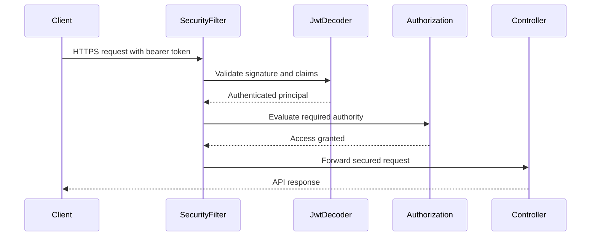
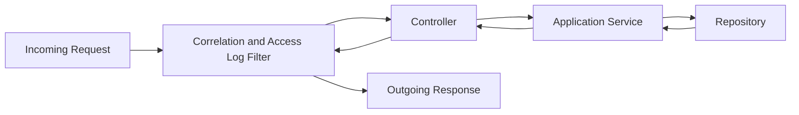
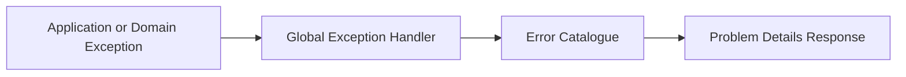

# Transaction Aggregation API
# Solution Architecture Document (SAD)

**Version:** 3.0  
**Part 5 – API & Security**

---

# 34. REST API Design

## 34.1 API Style

The Transaction Aggregation API exposes synchronous REST endpoints over HTTPS.

The API follows resource-oriented design principles:

- Resources are represented using nouns.
- HTTP methods express the intended action.
- Standard HTTP status codes communicate outcomes.
- JSON is used for request and response payloads.
- Endpoints are versioned.
- Pagination, filtering and sorting follow consistent conventions.
- Error responses use RFC 9457 Problem Details.

The base path is:

```text
/api/v1
```

Example resources:

```text
/api/v1/transactions
/api/v1/customers
/api/v1/customers/{customerId}/summary
/api/v1/categories
/api/v1/merchants
```

---

## 34.2 HTTP Method Conventions

| Method | Purpose |
|--------|---------|
| GET | Retrieve a resource or collection |
| POST | Create a resource or execute a processing operation |
| PUT | Replace a complete mutable resource |
| PATCH | Partially update a mutable resource |
| DELETE | Remove a resource where deletion is permitted |

Processed financial transactions are immutable. Therefore, transaction update and deletion endpoints are not exposed in the initial release.

---

## 34.3 URI Design Standards

- Use lowercase resource names.
- Use plural nouns for collections.
- Use path parameters for resource identity.
- Use query parameters for filtering, pagination and sorting.
- Avoid verbs in endpoint paths unless the operation does not map naturally to a resource.
- Do not expose database table or Java class names through the API.

Examples:

```text
GET /api/v1/transactions/{transactionId}
```

```text
GET /api/v1/transactions?customerId={id}&direction=DEBIT
```

```text
GET /api/v1/customers/{customerId}/summary
```

---

## 34.4 API Versioning

The API uses URI-based major versioning:

```text
/api/v1
```

Versioning rules:

- Breaking changes require a new major API version.
- Additive, backward-compatible fields do not require a new major version.
- Existing response fields must not be removed or renamed within the same major version.
- Deprecated endpoints and fields must be documented.
- Deprecation should include a migration period where practical.

---

## 34.5 Content Negotiation

Request and response bodies use:

```text
Content-Type: application/json
```

Clients should send:

```text
Accept: application/json
```

Unsupported media types return:

```text
HTTP 415 Unsupported Media Type
```

---

## 34.6 Pagination

Collection endpoints use zero-based page pagination.

Example:

```text
GET /api/v1/transactions?page=0&size=20
```

Default values:

| Parameter | Default | Maximum |
|-----------|---------|---------|
| page | 0 | N/A |
| size | 20 | 100 |

Example paginated response:

```json
{
  "content": [],
  "page": {
    "number": 0,
    "size": 20,
    "totalElements": 0,
    "totalPages": 0
  }
}
```

The API must reject invalid page sizes instead of silently accepting unbounded requests.

---

## 34.7 Filtering

Transaction search supports:

- `customerId`
- `sourceCode`
- `categoryCode`
- `merchantId`
- `direction`
- `status`
- `occurredFrom`
- `occurredTo`

Example:

```text
GET /api/v1/transactions?customerId=...&direction=DEBIT&occurredFrom=2026-07-01T00:00:00Z&occurredTo=2026-07-31T23:59:59Z
```

Filtering rules:

- All supplied filters are combined using logical AND.
- Date ranges must be valid.
- Unsupported filter values return HTTP 400.
- Maximum date-range limits may be configured to protect performance.

---

## 34.8 Sorting

Sorting uses:

```text
sort=<field>,<direction>
```

Example:

```text
GET /api/v1/transactions?sort=occurredAt,desc
```

Allowed sort fields are explicitly whitelisted.

The API must not pass arbitrary client-provided property names directly into persistence queries.

---

## 34.9 Idempotency

Single transaction ingestion is idempotent through the natural transaction reference:

```text
transactionSource + externalTransactionId
```

Repeated submission of the same source transaction returns a conflict response unless a future endpoint explicitly supports idempotent replay semantics.

For future externally initiated operations that do not have a natural key, an `Idempotency-Key` request header may be introduced.

---

## 34.10 Correlation IDs

Every request uses a correlation identifier.

Request header:

```text
X-Correlation-ID
```

Behaviour:

- The API accepts a valid client-supplied correlation ID.
- The API generates one when none is supplied.
- The ID is returned in the response.
- The ID is included in structured logs, audit events and error responses.

---

## 34.11 Date, Time and Currency Formats

- Date and time values use ISO 8601.
- Internal timestamps are stored and processed in UTC.
- API timestamps include an offset or `Z`.
- Currency uses ISO 4217 codes.
- Initial supported currency is `ZAR`.
- Monetary values are represented as JSON numbers with controlled precision.

Example:

```json
{
  "amount": 349.95,
  "currency": "ZAR",
  "occurredAt": "2026-07-30T08:15:00Z"
}
```

---

# 35. API Contracts

## 35.1 Create Transaction

### Endpoint

```text
POST /api/v1/transactions
```

### Required Role

```text
TRANSACTION_WRITE
```

### Request

```json
{
  "customerId": "8ce1747b-c94b-4328-a91b-9359954207c4",
  "sourceCode": "MOCK_BANK_A",
  "externalTransactionId": "TXN-20260730-00001",
  "merchantName": "Woolworths Centurion",
  "amount": 349.95,
  "currency": "ZAR",
  "direction": "DEBIT",
  "description": "Card purchase",
  "occurredAt": "2026-07-30T08:15:00Z"
}
```

### Response

```text
HTTP 201 Created
Location: /api/v1/transactions/{transactionId}
```

```json
{
  "id": "6b496874-c4b0-4f21-8f1b-a50535f5395f",
  "customerId": "8ce1747b-c94b-4328-a91b-9359954207c4",
  "sourceCode": "MOCK_BANK_A",
  "externalTransactionId": "TXN-20260730-00001",
  "merchant": {
    "id": "37e3bc6b-48de-4fc5-a566-da657a50336c",
    "displayName": "Woolworths Centurion"
  },
  "category": {
    "code": "GROCERIES",
    "name": "Groceries"
  },
  "amount": 349.95,
  "currency": "ZAR",
  "direction": "DEBIT",
  "description": "Card purchase",
  "status": "PROCESSED",
  "occurredAt": "2026-07-30T08:15:00Z",
  "receivedAt": "2026-07-30T08:15:03Z",
  "createdAt": "2026-07-30T08:15:03Z"
}
```

### Responses

| Status | Meaning |
|--------|---------|
| 201 | Transaction created |
| 400 | Invalid request |
| 401 | Authentication required |
| 403 | Insufficient permission |
| 404 | Customer or source not found |
| 409 | Duplicate transaction |
| 422 | Semantically invalid transaction |
| 500 | Unexpected server error |

---

## 35.2 Bulk Create Transactions

### Endpoint

```text
POST /api/v1/transactions/bulk
```

### Request Constraint

Maximum initial batch size:

```text
500 transactions
```

### Response

```text
HTTP 207 Multi-Status
```

```json
{
  "total": 3,
  "successful": 2,
  "failed": 1,
  "results": [
    {
      "index": 0,
      "status": "CREATED",
      "transactionId": "9f9008dc-8259-4222-bd23-320245c6a644"
    },
    {
      "index": 1,
      "status": "CONFLICT",
      "errorCode": "TRANSACTION_DUPLICATE",
      "detail": "A transaction with the supplied source reference already exists."
    },
    {
      "index": 2,
      "status": "CREATED",
      "transactionId": "da74fc23-17ff-4bf9-8a73-6b4bc8e06799"
    }
  ]
}
```

Each item is processed independently to support partial success.

---

## 35.3 Retrieve Transaction

### Endpoint

```text
GET /api/v1/transactions/{transactionId}
```

### Required Role

```text
TRANSACTION_READ
```

### Responses

| Status | Meaning |
|--------|---------|
| 200 | Transaction returned |
| 401 | Authentication required |
| 403 | Insufficient permission |
| 404 | Transaction not found |

---

## 35.4 Search Transactions

### Endpoint

```text
GET /api/v1/transactions
```

### Example

```text
GET /api/v1/transactions?customerId={customerId}&direction=DEBIT&page=0&size=20&sort=occurredAt,desc
```

### Response

```json
{
  "content": [
    {
      "id": "6b496874-c4b0-4f21-8f1b-a50535f5395f",
      "customerId": "8ce1747b-c94b-4328-a91b-9359954207c4",
      "merchantName": "Woolworths Centurion",
      "categoryCode": "GROCERIES",
      "amount": 349.95,
      "currency": "ZAR",
      "direction": "DEBIT",
      "occurredAt": "2026-07-30T08:15:00Z"
    }
  ],
  "page": {
    "number": 0,
    "size": 20,
    "totalElements": 1,
    "totalPages": 1
  }
}
```

---

## 35.5 Customer Financial Summary

### Endpoint

```text
GET /api/v1/customers/{customerId}/summary
```

### Query Parameters

- `from`
- `to`

### Response

```json
{
  "customerId": "8ce1747b-c94b-4328-a91b-9359954207c4",
  "period": {
    "from": "2026-07-01T00:00:00Z",
    "to": "2026-07-31T23:59:59Z"
  },
  "currency": "ZAR",
  "totalIncome": 42000.00,
  "totalExpenditure": 18749.50,
  "netCashFlow": 23250.50,
  "transactionCount": 67
}
```

---

## 35.6 Category Summary

### Endpoint

```text
GET /api/v1/customers/{customerId}/summaries/categories
```

### Response

```json
{
  "customerId": "8ce1747b-c94b-4328-a91b-9359954207c4",
  "currency": "ZAR",
  "categories": [
    {
      "categoryCode": "GROCERIES",
      "categoryName": "Groceries",
      "totalAmount": 4250.75,
      "transactionCount": 18
    }
  ]
}
```

---

## 35.7 Merchant Summary

### Endpoint

```text
GET /api/v1/customers/{customerId}/summaries/merchants
```

Returns expenditure grouped by normalised merchant.

---

## 35.8 Monthly Summary

### Endpoint

```text
GET /api/v1/customers/{customerId}/summaries/monthly
```

### Response

```json
{
  "customerId": "8ce1747b-c94b-4328-a91b-9359954207c4",
  "currency": "ZAR",
  "months": [
    {
      "month": "2026-07",
      "income": 42000.00,
      "expenditure": 18749.50,
      "netCashFlow": 23250.50,
      "transactionCount": 67
    }
  ]
}
```

---

## 35.9 API Documentation

Springdoc OpenAPI generates machine-readable API documentation.

Recommended endpoints:

```text
/v3/api-docs
/swagger-ui.html
```

Documentation must include:

- Endpoint purpose.
- Authentication requirements.
- Role requirements.
- Request and response schemas.
- Validation rules.
- Error responses.
- Example payloads.
- Pagination and filtering behaviour.

Swagger UI access should be restricted or disabled in production according to deployment policy.

---

# 36. Security Architecture

## 36.1 Security Objectives

The security architecture protects:

- Customer transaction data.
- API credentials and tokens.
- Business operations.
- Audit information.
- Database credentials.
- Operational endpoints.

The design follows least privilege, defence in depth and secure-by-default principles.

---

## 36.2 Authentication

The API uses bearer JWT authentication.

Request header:

```text
Authorization: Bearer <token>
```

The initial implementation validates tokens using Spring Security.

Production deployment should validate tokens issued by a trusted identity provider rather than issuing long-lived application-managed tokens.

---

## 36.3 JWT Claims

Expected claims include:

| Claim | Purpose |
|-------|---------|
| sub | Authenticated principal |
| iss | Token issuer |
| aud | Intended API audience |
| exp | Expiration time |
| iat | Issued-at time |
| jti | Unique token identifier |
| roles or authorities | Granted permissions |

Validation rules:

- Signature must be valid.
- Token must not be expired.
- Issuer must match configuration.
- Audience must include the API.
- Required claims must exist.
- Supported signing algorithms must be explicitly restricted.

The API must not accept the JWT algorithm from the token without validating it against configured trusted algorithms.

---

## 36.4 Authorisation

Role-based access control protects operations.

| Authority | Permission |
|-----------|------------|
| TRANSACTION_READ | Read transactions |
| TRANSACTION_WRITE | Create transactions |
| CUSTOMER_READ | Read customer data |
| AGGREGATION_READ | Read summaries |
| CATEGORY_ADMIN | Manage categories and rules |
| AUDIT_READ | Read audit information |
| OPERATIONS_READ | Access selected operational endpoints |

Method-level security provides protection in addition to URL-level rules.

Example:

```java
@PreAuthorize("hasAuthority('TRANSACTION_WRITE')")
```

These authorities are the unit of protection for individual operations and are never assigned to a client directly. Clients are instead assigned **roles** — named, coarser collections of these authorities, documented alongside the approved role-to-authority mapping in the Technical Design Specification (§42) and formalised in ADR-016 (§49.1). A JWT's `roles` claim is expanded into the mapped set of authorities at authentication time; `@PreAuthorize` always evaluates authorities, never role names.

---

## 36.5 Security Flow



---

## 36.6 Transport Security

- HTTPS is mandatory outside local development.
- TLS termination may occur at a trusted reverse proxy or load balancer.
- Plain HTTP requests should be redirected or rejected.
- Secure protocol and cipher configuration is managed by the deployment platform.
- Internal network communication should also be encrypted where required.

---

## 36.7 Input Security

- Request payloads use strict Bean Validation.
- Unknown or dangerous input is rejected.
- SQL statements are parameterised.
- Dynamic sorting fields are whitelisted.
- Regex categorisation rules must be protected against excessive processing.
- Maximum payload and batch sizes are enforced.
- Sensitive data is never accepted through query parameters when avoidable.

---

## 36.8 Secrets Management

Secrets must not be committed to source control.

Protected values include:

- Database passwords.
- JWT verification keys.
- Identity-provider credentials.
- Monitoring credentials.
- Encryption keys.

Local development may use environment variables or ignored `.env` files.

Production should use a managed secret store provided by the deployment environment.

---

## 36.9 Data Protection

- Sensitive data is encrypted in transit.
- Database and backup encryption at rest should be enabled by the hosting platform.
- Logs must not contain access tokens or credentials.
- Personally identifiable information should be minimised.
- API responses expose only fields required by the client.
- Database access is restricted to the application service account and authorised administrators.

---

## 36.10 Operational Endpoint Security

Actuator endpoint exposure is explicitly configured.

Publicly accessible:

```text
/actuator/health/liveness
/actuator/health/readiness
```

Restricted:

```text
/actuator/metrics
/actuator/loggers
/actuator/env
```

Sensitive endpoints such as environment details must not be publicly exposed.

---

## 36.11 Security Headers

Where applicable, responses include:

- `X-Content-Type-Options: nosniff`
- `Cache-Control: no-store` for sensitive responses
- `Content-Security-Policy` for browser-accessible documentation interfaces
- `Strict-Transport-Security` when HTTPS is enforced

The API does not rely on browser security headers as a substitute for authentication and authorisation.

---

## 36.12 CORS

Cross-Origin Resource Sharing is disabled by default unless a browser-based client requires it.

When enabled:

- Allowed origins are explicit.
- Wildcard origins are prohibited for credentialed requests.
- Allowed methods and headers are restricted.
- Configuration differs by environment.

---

## 36.13 Threat Considerations

| Threat | Control |
|--------|---------|
| Credential theft | Short-lived JWTs, TLS, secret management |
| Broken authorisation | RBAC and method security |
| Injection | Parameterised queries and input validation |
| Duplicate processing | Idempotency checks and unique constraints |
| Data leakage through logs | Logging redaction rules |
| Denial of service | Payload limits, pagination, timeouts and rate limiting |
| Token replay | Short token lifetime, `jti` support and issuer controls |
| Excessive data exposure | Purpose-specific response DTOs |
| Sensitive actuator exposure | Endpoint allow-list and authentication |

---

# 37. Logging

## 37.1 Logging Standard

The application uses structured logging.

Production logs should be emitted as JSON to simplify ingestion by central logging platforms.

Every request log should contain, where applicable:

- Timestamp.
- Log level.
- Service name.
- Environment.
- Correlation ID.
- Request method.
- Request path.
- Response status.
- Duration.
- Authenticated principal identifier.
- Domain operation.
- Error code.
- Exception type.

---

## 37.2 Log Levels

| Level | Usage |
|-------|-------|
| ERROR | Unexpected failures requiring attention |
| WARN | Recoverable or suspicious conditions |
| INFO | Important lifecycle and business-operation events |
| DEBUG | Diagnostic development information |
| TRACE | Highly detailed diagnostics, disabled by default |

Production logging should normally operate at `INFO`, with targeted temporary adjustments when diagnosing incidents.

---

## 37.3 Logging Boundaries

Recommended request logging flow:



The access filter records request completion and elapsed time without logging sensitive payloads.

---

## 37.4 Sensitive Data Redaction

The following must never be logged:

- Bearer tokens.
- Passwords.
- Private keys.
- Database credentials.
- Full authentication headers.
- Secret environment variables.
- Unnecessary personal data.
- Complete raw payloads when they contain sensitive customer information.

When diagnostic identifiers are needed, masked or hashed forms should be used.

---

## 37.5 Business and Technical Logs

Technical logs explain system behaviour.

Examples:

- Database timeout.
- Invalid JWT.
- Categorisation rule execution failure.

Business audit events record actions with compliance or traceability value.

Examples:

- Transaction accepted.
- Transaction rejected as duplicate.
- Category assigned.
- Categorisation rule changed.

Audit events are not replaced by ordinary application logs.

---

# 38. Observability

## 38.1 Observability Pillars

The application uses four complementary observability signals:

1. Logs
2. Metrics
3. Traces
4. Health indicators

---

## 38.2 Metrics

Spring Boot Actuator and Micrometer expose operational metrics.

Recommended metrics include:

### HTTP Metrics

- Request count.
- Response time.
- Error rate.
- Active requests.
- Responses by status code.

### Transaction Metrics

- Transactions received.
- Transactions processed.
- Transactions rejected.
- Duplicate transactions.
- Categorisation fallback count.
- Bulk-processing success and failure counts.

### Persistence Metrics

- Database connection-pool utilisation.
- Query duration.
- Transaction rollback count.
- Connection acquisition time.

### JVM Metrics

- Heap usage.
- Garbage-collection duration.
- Thread count.
- CPU utilisation.
- Application uptime.

---

## 38.3 Custom Business Metrics

Example metric names:

```text
transactions.received.total
transactions.processed.total
transactions.rejected.total
transactions.duplicates.total
transactions.categorisation.fallback.total
transactions.processing.duration
```

Metric labels must have controlled cardinality.

Customer IDs, transaction IDs and correlation IDs must not be used as metric labels.

---

## 38.4 Health Checks

Liveness determines whether the process should be restarted.

```text
GET /actuator/health/liveness
```

Readiness determines whether the application can accept traffic.

```text
GET /actuator/health/readiness
```

Readiness should consider critical dependencies such as PostgreSQL.

A temporary database failure may make the application unready without making it non-live.

---

## 38.5 Distributed Tracing

OpenTelemetry-compatible tracing is recommended.

Trace propagation should use the W3C Trace Context standard.

Important spans include:

- HTTP request.
- Transaction ingestion use case.
- Categorisation.
- Database operation.
- Audit publication.

Although the initial deployment is a modular monolith, trace support prepares the solution for future distributed services.

---

## 38.6 Dashboards

An operational dashboard should display:

- Request throughput.
- API latency percentiles.
- HTTP error rate.
- Transaction-processing rate.
- Duplicate rate.
- Rejection rate.
- Fallback categorisation rate.
- Database pool usage.
- JVM memory and CPU.

---

## 38.7 Alerting

Recommended initial alerts:

| Alert | Example Condition |
|-------|-------------------|
| High server error rate | HTTP 5xx rate exceeds threshold |
| High API latency | p95 latency exceeds target |
| Database unavailable | Readiness fails |
| Connection pool saturation | Pool utilisation remains high |
| Transaction rejection spike | Rejection rate deviates materially |
| Duplicate spike | Duplicate count rises unexpectedly |
| Application restart loop | Repeated liveness failures |

Thresholds must be tuned from observed production behaviour rather than copied blindly between environments.

---

## 38.8 Service-Level Objectives

Initial internal objectives may include:

- 99.9% successful availability for supported API operations.
- p95 read response time below 500 ms under normal load.
- No loss of successfully committed transactions.
- Operational detection of critical failures within five minutes.

These are design targets and must be formally approved before being treated as contractual service levels.

---

# 39. Error Handling

## 39.1 Error Response Standard

The API uses RFC 9457 Problem Details.

Media type:

```text
application/problem+json
```

Example:

```json
{
  "type": "https://errors.example.com/transaction-duplicate",
  "title": "Duplicate transaction",
  "status": 409,
  "detail": "A transaction with the supplied source reference already exists.",
  "instance": "/api/v1/transactions",
  "errorCode": "TRANSACTION_DUPLICATE",
  "correlationId": "f68017fa-2f98-4a52-a356-21fe41004965",
  "timestamp": "2026-07-30T08:15:04Z"
}
```

---

## 39.2 Validation Error Response

```json
{
  "type": "https://errors.example.com/request-validation-failed",
  "title": "Request validation failed",
  "status": 400,
  "detail": "One or more request fields are invalid.",
  "instance": "/api/v1/transactions",
  "errorCode": "REQUEST_VALIDATION_FAILED",
  "correlationId": "b4a56026-aef0-4e6a-b93a-17607d808861",
  "timestamp": "2026-07-30T08:20:00Z",
  "violations": [
    {
      "field": "amount",
      "message": "must be greater than zero"
    },
    {
      "field": "currency",
      "message": "must be a supported ISO 4217 currency code"
    }
  ]
}
```

---

## 39.3 HTTP Status Mapping

| Status | Usage |
|--------|-------|
| 200 | Successful retrieval |
| 201 | Resource created |
| 207 | Bulk request with mixed item outcomes |
| 400 | Invalid syntax, validation or query parameter |
| 401 | Missing or invalid authentication |
| 403 | Authenticated but not authorised |
| 404 | Requested resource does not exist |
| 409 | Duplicate or state conflict |
| 415 | Unsupported media type |
| 422 | Valid request format but invalid business semantics |
| 429 | Rate limit exceeded |
| 500 | Unexpected internal failure |
| 503 | Service temporarily unavailable |

---

## 39.4 Error Catalogue

| Error Code | HTTP Status | Description |
|------------|-------------|-------------|
| REQUEST_VALIDATION_FAILED | 400 | Request validation failed |
| INVALID_DATE_RANGE | 400 | Start date occurs after end date |
| INVALID_SORT_FIELD | 400 | Unsupported sorting field |
| AUTHENTICATION_REQUIRED | 401 | Valid authentication was not supplied |
| TOKEN_INVALID | 401 | Token validation failed |
| ACCESS_DENIED | 403 | Principal lacks required authority |
| CUSTOMER_NOT_FOUND | 404 | Customer does not exist |
| TRANSACTION_NOT_FOUND | 404 | Transaction does not exist |
| SOURCE_NOT_FOUND | 404 | Transaction source does not exist |
| CATEGORY_NOT_FOUND | 404 | Category does not exist |
| TRANSACTION_DUPLICATE | 409 | Source transaction already exists |
| OPTIMISTIC_LOCK_CONFLICT | 409 | Aggregate changed concurrently |
| CUSTOMER_NOT_ACTIVE | 422 | Customer cannot receive transactions |
| SOURCE_NOT_ACTIVE | 422 | Source cannot submit transactions |
| UNSUPPORTED_CURRENCY | 422 | Currency is not supported |
| TRANSACTION_RULE_VIOLATION | 422 | Domain rule was violated |
| RATE_LIMIT_EXCEEDED | 429 | Too many requests |
| INTERNAL_SERVER_ERROR | 500 | Unexpected server-side failure |
| DATABASE_UNAVAILABLE | 503 | Database dependency unavailable |

---

## 39.5 Exception Handling Design

A global exception handler maps internal exceptions to API problem responses.



Implementation responsibilities:

- Controllers do not manually build error responses.
- Domain exceptions contain business meaning, not HTTP concerns.
- The exception handler maps exception types to status and error codes.
- Unexpected exceptions are logged once at the boundary.
- Internal stack traces are never returned to clients.
- Every error response includes the correlation ID.

---

## 39.6 Error Disclosure

Client responses must not expose:

- Stack traces.
- SQL statements.
- Database names.
- Internal class names.
- File-system paths.
- Secret configuration.
- Raw identity-provider errors.

Detailed diagnostics remain available in secured logs using the correlation ID.

---

## 39.7 Retry Behaviour

Clients may retry:

- HTTP 429 after respecting `Retry-After`.
- HTTP 503 for transient unavailability.
- Network failures where the operation is idempotent.

Clients should not automatically retry:

- HTTP 400.
- HTTP 401 without obtaining valid credentials.
- HTTP 403.
- HTTP 409 duplicate transaction.
- HTTP 422.

Server-side retry must be limited to explicitly transient operations and must never cause duplicate financial processing.

---

## 39.8 Bulk Error Handling

Bulk responses report each item independently.

One invalid item does not roll back successfully processed items.

Each failed item includes:

- Original item index.
- Error code.
- Error detail.
- Optional field violations.
- Correlation or batch trace information.

The API must not return a successful overall status that hides item-level failures.

---

# 40. API and Security Summary

The API architecture provides a consistent, versioned REST interface for transaction ingestion, retrieval and financial aggregation.

Security is implemented through JWT authentication, role-based authorisation, HTTPS, strict validation, protected secrets and least-privilege access. Structured logging, metrics, traces and health indicators provide operational visibility without exposing sensitive information.

RFC 9457 Problem Details standardises errors across all endpoints, while stable application error codes allow clients to respond predictably without depending on human-readable messages.

---

## End of Part 5

The next section defines deployment architecture, Docker strategy, configuration management, testing, scalability, future evolution, risks and supporting appendices.
