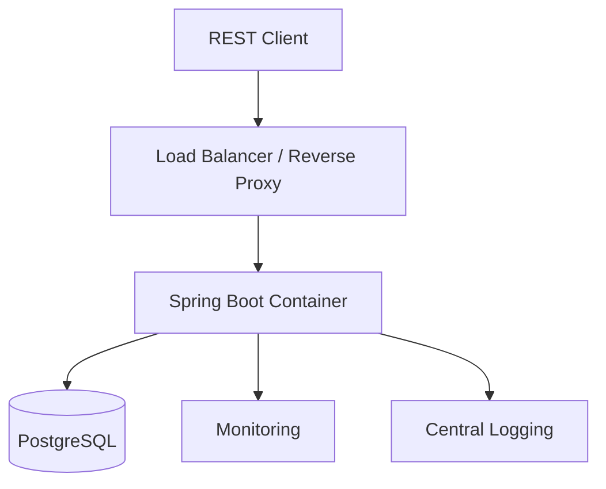
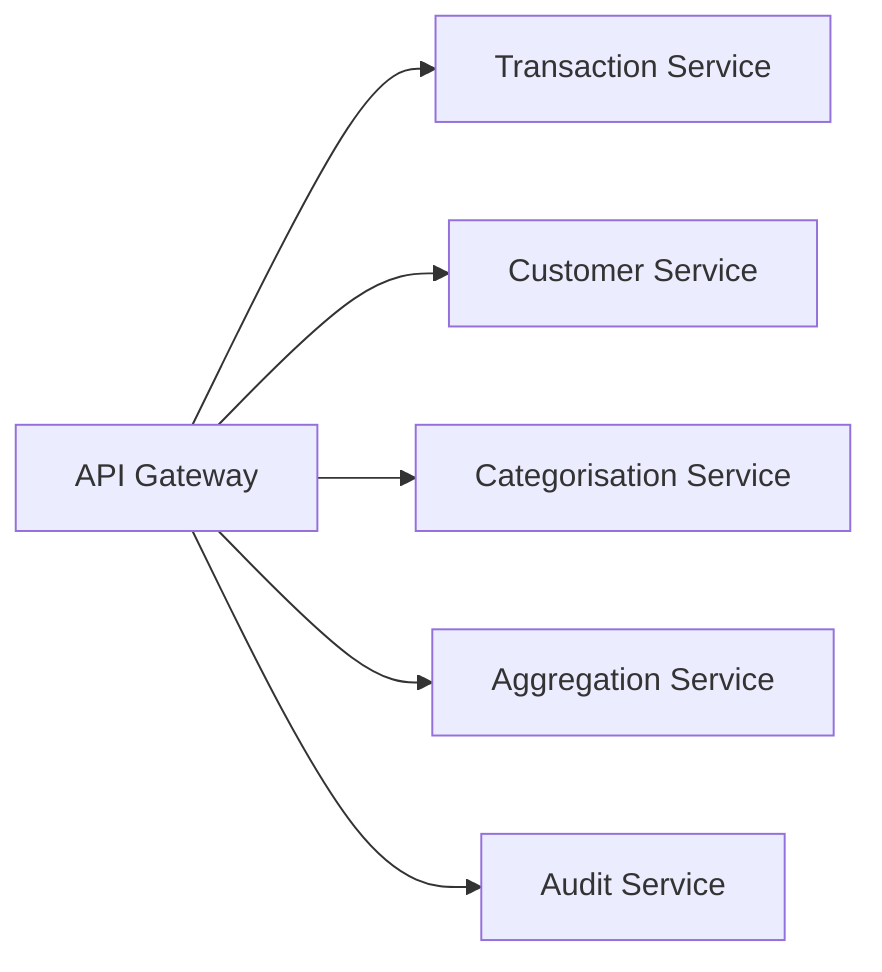

# Transaction Aggregation API
# Solution Architecture Document (SAD)

**Version:** 3.0  
**Part 6A – Operations**

---

# 41. Deployment Architecture

## 41.1 Deployment Overview

The Transaction Aggregation API is deployed as a containerised Spring Boot application backed by PostgreSQL. The architecture follows the twelve-factor application principles with externalised configuration and stateless application instances.

Core deployment characteristics:

- Stateless application instances
- External PostgreSQL database
- HTTPS entry point
- Container-based packaging
- Environment-specific configuration
- Health probes for orchestration
- Centralised logging and metrics

## 41.2 Runtime Components

| Component | Responsibility |
|-----------|----------------|
| Reverse Proxy / Load Balancer | HTTPS termination and traffic routing |
| Spring Boot API | Business logic and REST endpoints |
| PostgreSQL | System of record |
| Monitoring Platform | Metrics and health monitoring |
| Log Platform | Centralised structured logging |

---

# 42. Deployment Diagram



Deployment principles:

- No local file dependencies.
- Stateless containers.
- Database hosted independently.
- Infrastructure is replaceable without application changes.

---

# 43. Docker Strategy

## 43.1 Containerisation

The application is packaged as a Docker image.

Example build flow:

```text
Source Code
      ↓
 Maven Build
      ↓
 Spring Boot Jar
      ↓
 Docker Image
      ↓
 Container Registry
      ↓
 Deployment
```

## 43.2 Dockerfile Principles

- Multi-stage build.
- Non-root runtime user.
- Small production base image.
- Health check support.
- Immutable image.
- External configuration only.

## 43.3 Docker Compose (Development)

Development compose services:

- transaction-api
- postgres

Benefits:

- One-command startup
- Consistent developer environments
- Local integration testing

---

# 44. Configuration Management

## 44.1 Configuration Principles

Configuration is externalised from application code.

Sources include:

- Environment variables
- Spring profiles
- Secrets manager
- Docker Compose
- Container orchestration platform

## 44.2 Spring Profiles

| Profile | Purpose |
|---------|---------|
| local | Developer workstation |
| test | Automated testing |
| dev | Shared development |
| qa | Quality assurance |
| prod | Production |

## 44.3 Externalised Properties

Examples:

- Database URL
- Database credentials
- JWT configuration
- Logging level
- API timeouts
- Batch limits
- Feature flags

Sensitive values must never be committed to source control.

---

# 45. Testing Strategy

## 45.1 Testing Pyramid

```text
        End-to-End
      Integration Tests
        Unit Tests
```

## 45.2 Test Types

| Test | Purpose |
|------|---------|
| Unit | Business logic |
| Integration | Database and persistence |
| API | REST contract validation |
| End-to-End | User scenarios |
| Performance | Response time and throughput |
| Security | Authentication and authorisation |

## 45.3 Automated Testing

Continuous Integration should execute:

- Static analysis
- Unit tests
- Integration tests
- API contract tests
- Build verification

Production deployments should only occur after all mandatory quality gates pass.

---

# 46. Scalability

## 46.1 Horizontal Scaling

Application instances are stateless and can be scaled horizontally behind a load balancer.

## 46.2 Database Scaling

Future strategies include:

- Read replicas
- Improved indexing
- Query optimisation
- Partitioning for very large datasets

## 46.3 Performance Optimisation

Recommended techniques:

- Pagination
- Connection pooling
- Efficient indexes
- Query tuning
- Response compression
- Caching of static reference data

---

# 47. Evolution to Microservices

## 47.1 Migration Strategy

The solution intentionally starts as a Modular Monolith.

Modules can later be extracted independently without changing business rules.

Candidate services:

- Transaction Service
- Customer Service
- Categorisation Service
- Aggregation Service
- Audit Service

## 47.2 Evolution Diagram



## 47.3 Migration Principles

- Extract one bounded context at a time.
- Preserve API compatibility.
- Introduce asynchronous communication where appropriate.
- Avoid distributed transactions.
- Replace in-process calls with events or APIs gradually.

## 47.4 Readiness Indicators

Migration should only occur when justified by measurable business or operational needs, such as:

- Independent deployment requirements
- Team ownership boundaries
- Scalability bottlenecks
- Different release cadences
- Technology diversification

---

# 48. Operations Summary

The operational architecture prioritises simplicity, reliability and maintainability. The solution is deployed as a containerised Spring Boot application with externalised configuration, automated testing and horizontal scalability. Beginning with a modular monolith minimises operational complexity while preserving a clear path to future microservice adoption.

---

## End of Part 6A

The remaining governance section (Part 6B) covers Architecture Decision Records, Risks, Future Improvements, Technology Stack, Glossary, References and Appendices.
